# LangGraph Adaptive Interviewer

> **A Self-Correcting Multi-Agent System with Dynamic Prompt Optimization**

A production-grade demonstration of **Multi-Agent Orchestration** where autonomous agents collaborate, critique each other, and **self-improve in real-time**. This system goes beyond simple chatbots by implementing bidirectional feedback loops, dynamic prompt injection, and safeguards against infinite loops.

---

## Why This Project Stands Out

| Aspect | Typical Tutorial Code | This Implementation |
|--------|----------------------|---------------------|
| **Control Flow** | Legacy `conditional_edges` | Modern `Command(goto=...)` pattern |
| **Memory** | Simple conversation history | Semantic Triples (Subject-Predicate-Object) |
| **Agent Interaction** | One-way handoff | Bidirectional feedback loop with rejection |
| **Prompts** | Static system prompts | Dynamic injection via `LangMem` optimizer |
| **Safety** | None | Loop count guards & forced termination |

---

## System Architecture

```mermaid
graph TD
    subgraph UserInterface["User Interface Layer"]
        User((👤 Candidate))
    end

    subgraph Orchestration["Agent Orchestration Layer"]
        Interviewer["👮 Interview Agent"]
        Reviewer["👨‍⚖️ Review Agent"]
        End((📋 Final Verdict))
    end

    subgraph Intelligence["Intelligence Layer"]
        Memory[("Semantic Memory<br/>LangMem Store")]
        RAG["Job Requirements<br/>Mock RAG"]
        Optimizer["⚡ Prompt Optimizer"]
    end

    subgraph Safety["Safety Layer"]
        Guard{" Loop Guard<br/>count > 3?"}
        ForceEnd((Force End))
    end

    User -->|"Q&A"| Interviewer
    Interviewer -->|"handoff: review request"| Reviewer
    Reviewer -->|"❌ Insufficient info"| Interviewer
    Reviewer -->|"✅ Decision"| End

    Interviewer -->|"store Triple"| Memory
    Interviewer -->|"query"| RAG
    Reviewer -->|"analyze trajectories"| Optimizer
    Optimizer -->|"inject SystemMessage"| Reviewer

    Reviewer --> Guard
    Guard -->|"Yes"| ForceEnd

    style Optimizer fill:#9B59B6,color:#fff
    style Memory fill:#3498DB,color:#fff
    style Guard fill:#E74C3C,color:#fff
```


---

## Technical Deep Dive

### 1. Bidirectional Agent Feedback Loop

Unlike simple "A → B → End" flows, this system implements **true self-correction**:

```
Interview Agent ──────► Review Agent
       ▲                     │
       │    "Need more info  │
       │     about AWS exp"  │
       └─────────────────────┘
```

The Review Agent doesn't just accept whatever the Interviewer provides. It **actively critiques** the conversation and can reject conclusions, sending control back with specific instructions.

```python
# Review Agent rejects and loops back
if isinstance(last_msg, AIMessage) and last_msg.tool_calls:
    return Command(
        update={**response, "last_agent": "review_agent", "loop_count": loop_count + 1},
        goto="interview_agent"  # Rejection & Loop Back!
    )
```

### 2. Dynamic Prompt Optimization (LangMem)

The system **learns from its own interactions**. The Review Agent analyzes past conversation trajectories and dynamically improves its analytical prompts:

```python
# Build learning trajectories from conversation history
trajectories = self._build_trajectories_from_messages(messages)

# Optimize the prompt based on past performance
opt_res = await self.prompt_optimizer.ainvoke({
    'trajectories': trajectories,
    'prompt': base_prompt_for_opt
})

# Inject the improved prompt into the agent's context
modified_messages = [SystemMessage(content=optimized_prompt)] + messages
response = await self._review_agent.ainvoke({**state, "messages": modified_messages})
```

**Key Insight**: The optimized `SystemMessage` is injected at the **top of the message stack**, effectively "reprogramming" the agent's behavior mid-session.

### 3. Semantic Triple Memory

Candidate information is stored not as raw text, but as **structured knowledge graphs**:

```python
class Triple(BaseModel):
    subject: str    # "Candidate"
    predicate: str  # "has experience in"
    object: str     # "Python development for 5 years"
    context: str    # "Mentioned during technical discussion"
```

This enables precise retrieval and reasoning, unlike vector-only approaches.

### 4. 🛡️ Production-Grade Safeguards

**The #1 fear in multi-agent systems: Infinite Loops.**

This implementation includes a `loop_count` guard that forces termination if agents get stuck in a critique cycle:

```python
if loop_count > 3:
    return Command(
        update={"messages": [AIMessage(content="Evaluation exceeded time limit. Terminating.")]},
        goto="__end__"
    )
```

### 5. ⚡ Modern LangGraph Patterns

This project uses the **latest** `Command` pattern instead of legacy `conditional_edges`:

```python
# ❌ Old Pattern (verbose, hard to maintain)
graph.add_conditional_edges("review", lambda s: "interview" if s["needs_more"] else "end")

# ✅ New Pattern (clean, self-documenting)
return Command(goto="interview_agent", update={...})
```

---

## Quick Start

### Prerequisites

- Python 3.10+
- OpenAI API Key

### Installation

```bash
git clone https://github.com/your-username/langgraph-adaptive-interviewer.git
cd langgraph-adaptive-interviewer
pip install -r requirements.txt
```

### Run the Demo

```bash
export OPENAI_API_KEY="sk-..."
python run_demo.py
```

### Sample Output

```
=== AI Interview & Review Multi-Agent Demo ===

👮 [Interviewer]: Welcome! I'll be conducting your technical interview today.
                  Could you tell me about your experience with Python?

you (put your answer here): I've worked with FastAPI and Django for 3 years.

   (tool: retrieve_job_requirements is running...)
   (tool: manage_memory is running...)

👮 [Interviewer]: Great! Can you describe a challenging project?

   (tool: transfer_to_review_agent is running...)

👨‍⚖️ [Reviewer]: Insufficient depth on cloud experience.
                 Sending back for follow-up questions.

   (tool: transfer_to_interview_agent is running...)

👮 [Interviewer]: I'd like to know more about your AWS experience...
```

---

## 📁 Project Structure

```
.
├── agent_core.py      # 🧠 Core logic: Agents, Tools, State Management
├── run_demo.py        # 🎨 CLI interface with colored output
├── requirements.txt   # 📦 Dependencies
└── README.md          # 📖 You are here
```

**Design Philosophy**: Clean separation between **business logic** (`agent_core.py`) and **presentation layer** (`run_demo.py`). The core module is framework-agnostic and can be integrated into FastAPI, Gradio, or any other interface.

---

## 🔧 Extending This Project

### Swap Mock RAG for Real Vector Store

```python
# Replace this:
@tool
def retrieve_job_requirements(query: str):
    return JOB_DESCRIPTION_DOCS.get(query, "Not found")

# With this:
from langchain_community.vectorstores import Pinecone

@tool
def retrieve_job_requirements(query: str):
    vectorstore = Pinecone.from_existing_index("job-requirements")
    return vectorstore.similarity_search(query, k=3)
```

### Add More Agents

The handoff pattern is designed for extensibility:

```python
# Create a new specialist agent
self.make_handoff_tool(agent_name="technical_deep_dive_agent")
self.make_handoff_tool(agent_name="culture_fit_agent")
```

---

## 🎓 Key Learnings Demonstrated

| Skill | Evidence in Code |
|-------|------------------|
| **LangGraph Mastery** | `Command` pattern, `StateGraph`, async streaming |
| **LangMem Integration** | `create_prompt_optimizer`, `create_manage_memory_tool` |
| **Production Thinking** | Loop guards, error handling, clean separation |
| **RAG Architecture** | Tool-based retrieval interface, ready for vector DB |
| **Multi-Agent Design** | Bidirectional handoffs, role separation |

---

## 👨‍💻 About the Author

I'm an **AI Engineer** specializing in building autonomous, self-improving agent systems using the LangChain ecosystem.

**What I Build:**
- 🔄 Multi-agent orchestration systems
- 🧠 RAG pipelines with semantic memory
- ⚡ Production-grade LLM applications
- 🛡️ Safe & reliable AI workflows

**Currently Available For:**
- Custom AI agent development
- LangGraph/LangChain architecture consulting
- RAG system optimization

---

## 📄 License

MIT License - Feel free to use this as a reference for your own projects.
